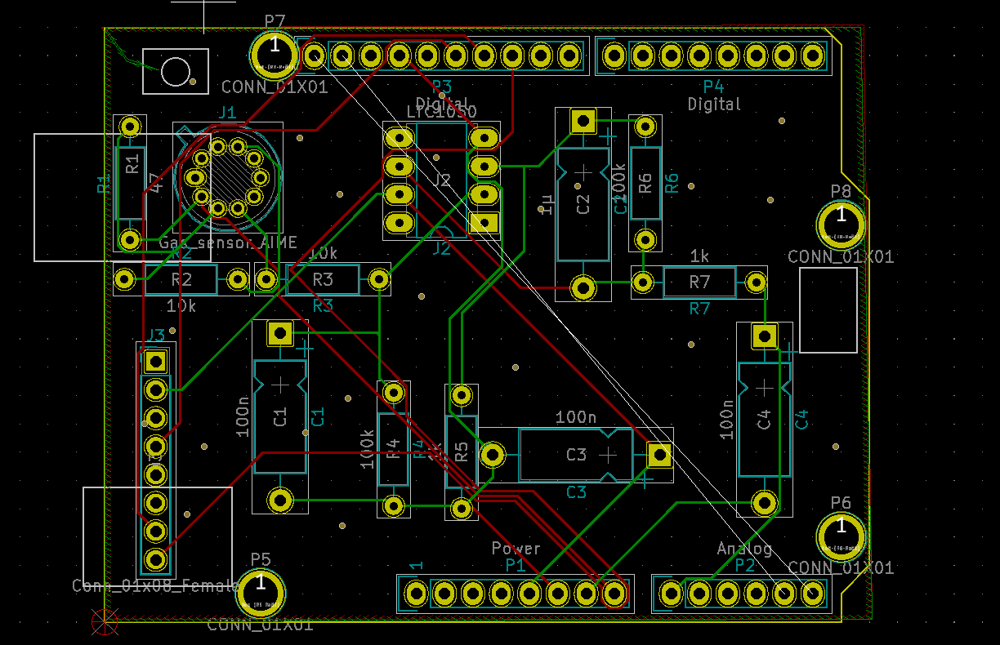
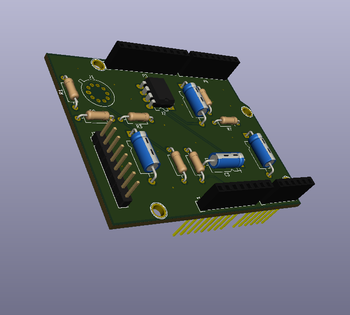

# 2020_2021_LEROCH_LICINI

### KiCad

[KiCad EDA - Schematic Capture & PCB Design Software](https://kicad-pcb.org/), version: 5.1.7

Open source EDA / electronics CAD software for Windows, macOS and Linux.

## Electrical diagram

## Components placement

## 3D view

